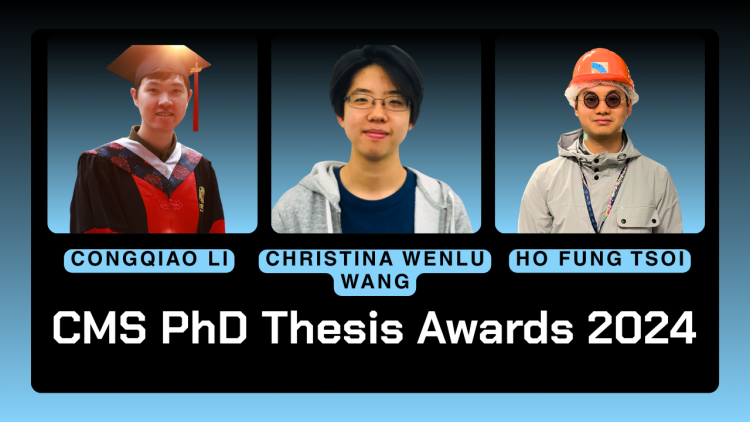
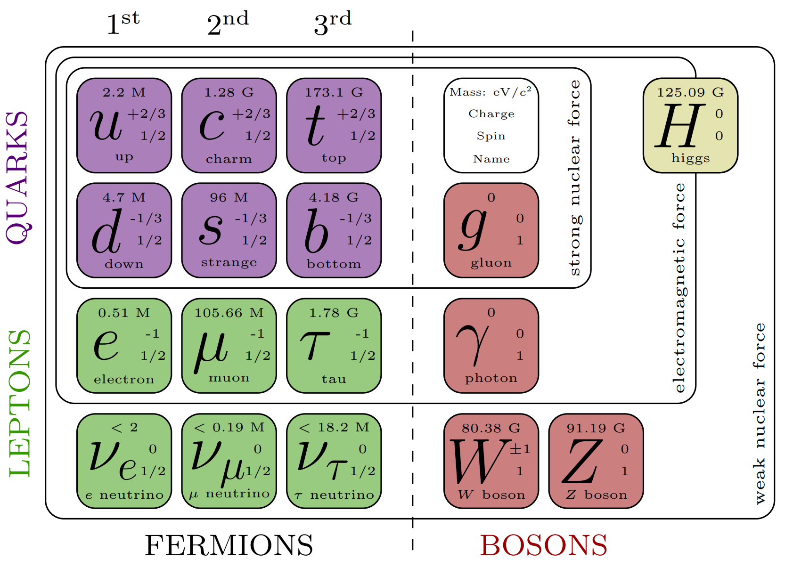
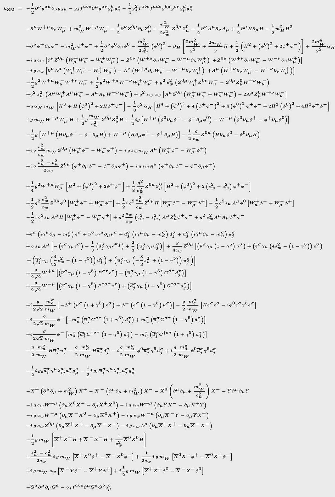
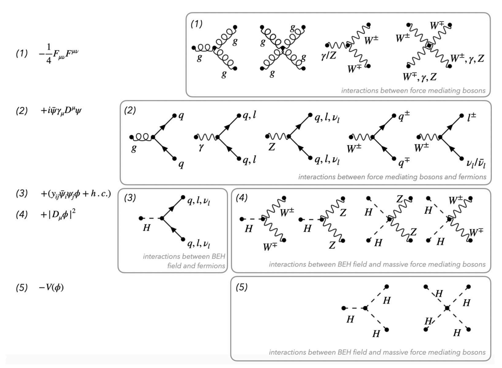
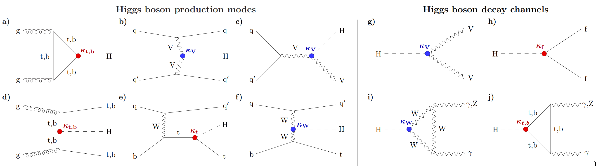
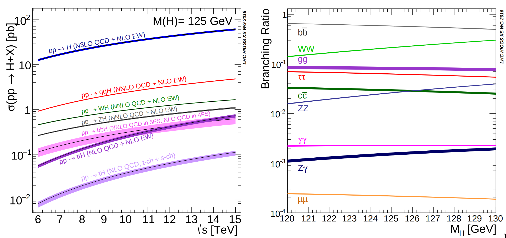

### Modern deep learning for large-$R$ jet tagging --- algorithms, calibration methods, and applications in the CMS experiment

- Author: Congqiao Li
- Supervisor: Prof. Qiang Li
- Award: CMS Ph.D. Thesis Award 2024

HSE CS PhD School $\bullet$ Best Dissertations Course

19.03.2026

<!--
The last comment block of each slide will be treated as slide notes. It will be visible and editable in Presenter Mode along with the slide. [Read more in the docs](https://sli.dev/guide/syntax.html#notes)
-->

---

# CMS Ph.D. Thesis Award

- Recognizes and rewards excellence in Ph.D. thesis research yearly since year 2000
- Targets students who submitted their Ph.Ds the previous year between August 1 and July 31
- The theses are judged on their content, originality, clarity of writing, and impact within CMS and the high energy physics in general and can be written on any CMS-related work

 

---

# Authors

  

**Li, Congqiao**

PhD from Peking University, China

  

  

  

**Li, Qiang**

Professor, State Key Laboratory of Nuclear Physics and Technology,
Peking University, China

  

---

# Publications

Experimental publications with significant contributions

- CMS Collaboration, “Search for Higgs boson decay to a charm quark-antiquark pair in proton-proton collisions at $\sqrt s$ = 13 TeV”, Phys. Rev. Lett. 131, 061801 (2023), arXiv: 2205.05550 [hep-ex].
- MS Collaboration, “Performance of heavy-flavour jet identification in boosted topologies in proton-proton collisions at $\sqrt s$ = 13 TeV”, CMS Physics Analysis Summary CMS-PAS-BTV-22-001, 2022.

---

# Publications

Phenomenological research

- C. Li, et al., “Accelerating resonance searches via signature-oriented pre-training”, arXiv:
2405.12972 [hep-ph].
- C. Li, et al., “Does Lorentz-symmetric design boost network performance in jet physics?”,
Phys. Rev. D 109, 056003 (2024), arXiv: 2208.07814 [hep-ph].
- H. Qu, C. Li, and S. Qian, “Particle Transformer for Jet Tagging”, in International Con-
ference on Machine Learning, pp. 18281-18292. PMLR, 2022, arXiv: 2202.03772
[hep-ph].
- S. Gong, et al., “An efficient Lorentz equivariant graph neural network for jet tagging”, JHEP 07, 030 (2022), arXiv: 2201.08187 [hep-ph].
- C. Li, et al., “Loop-induced $ZZ$ production at the LHC: An improved description by
matrix-element matching”, Phys. Rev. D 102, 116003 (2020), arXiv: 2006.12860 [hep-ph].

---

# Standard Model

History

1. Discovery of electron by J.J. Thomson in the 19th century, marking the divisibility of the atom.
2. Discovery of the nucleus in 1911 and neutron in 1932.
3. Emergence of quantum mechanics in the 1920s to describe atomic and subatomic processes.
4. Evolution of quantum mechanics into quantum field theory (QFT) in the 1940s.
5. Establishment of quantum electrodynamics (QED) in the 1940s, describing electromagnetic interactions within a quantum framework and integrated with special relativity.
6. Introduction of Yang-Mills theory in the 1950s, incorporating QFT with non-Abelian gauge group.
7. Formulation of quantum chromodynamics (QCD) in the 1960s and 1970s, describing strong interaction.
8. Explanation of particle mass acquisition through spontaneous symmetry breaking in gauge theories with Higgs mechanisms in the 1960s.
9. Introduction of the Standard Model (SM), a comprehensive theory unifying all known elementary particles and forces except for gravity.

---
layout: two-cols
---

# Standard Model

Key components of SM

* Higgs boson giving masses to other particles
* W and Z bosons as carriers of weak interaction
* Photon mediating electromagnetic force, remaining massless
* Gluon as massless boson mediating strong interaction
* Fermions as building blocks of matter, divided into quarks and leptons, constituting three generations

::right::

---

# Standard Model

Lagrangian

Built to respect $\text{SU}(3) \times \text{SU}(2) \times \text{U}(1)$ gauge symmetry.

$$
\mathcal L = -\frac14 F_{\mu\nu}^a F_a^{\mu\nu} + \bar\psi (i\gamma^\mu D_\mu - m) \psi + (y_{ij}\bar\psi_i\phi\psi_j + h.c.) + |D_\mu\phi|^2 - V(\phi)
$$

- The first term corresponds to the kinetic term for gauge field, where $F_{\mu\nu}$ is the field strength tensor that covers the electroweak force and the strong force
- The second term is the coupling of fermions, such as leptons and quarks, to the gauge field
- The third term characterizes the Yukawa coupling, and it describes the interaction of the fermion fields with the Higgs field
- The fourth term is the Higgs interaction with the boson field
- The fifth term is the Higgs field potential

---
layout: two-cols
---

# Standard Model

Lagrangian expanded form

We will use only relevant parts

::right::

---

# Feynman Diagram Vertices

---

# Standard Model

Higgs mechanism

Higgs field:

$$
\phi = \frac{1}{\sqrt2}\begin{pmatrix}
\phi^+\\
\phi^0
\end{pmatrix}, \quad \phi^{\bullet} \in \mathbb C
$$

Higgs potential:

$$
V(\phi) = \mu^2 \phi^\dagger \phi + \lambda (\phi^\dagger \phi)^2, \quad \mu^2 < 0, \lambda > 0
$$

Potential argmin (vaccum):

$$
\phi_{\text{vac}} = \frac{1}{\sqrt2}\begin{pmatrix}
0\\
v
\end{pmatrix}, \quad v = \sqrt{-\frac{\mu^2}{\lambda}}
$$

---

# Standard Model

Higgs mechanism

Rewrite Higgs field around $\phi_{\text{vac}}$

$$
\phi = \frac{1}{\sqrt2}\begin{pmatrix}
\phi_1^+ + i\phi_2^+\\
v + h + ia^0
\end{pmatrix}
$$

$\phi_1^+, \phi_2^+$, and $a^0$ are absorbed by the electroweak gauge fields, providing the necessary longitudinal
components for the $W^\pm$ and $Z$ bosons. This is the procedure through which they acquire masses.

$$
m_W^2 = \frac{g^2 v^2}{4}, \quad m_Z = \frac{(g^2 + g'^2) v^2}{4}
$$

$h$ is a physical Higgs boson (single scalar field degree of freedom) $m_H = v\sqrt{2\lambda}$.

---

# Standard Model

Higgs mechanism

After the electroweak symmetry
breaking, fermions gain mass through Yukawa interactions with the Higgs field:

$$
m_f = \frac{1}{\sqrt2}v y_f,
$$

where $y_f$ is the corresponding Yukawa coupling strength.

Part IV in this
dissertation focuses on the measurement of the Yukawa coupling between the Higgs boson
and the charm quark, $y_c$.

Pseudorapidity $\eta$ represents the angle of a particle relative to the beam axis:

$$
\eta \equiv -\ln\left[\tan\left(\frac{\theta}{2}\right)\right]
$$

---

# LHC Higgs Boson Production

Proton-proton collisions

- **Gluon fusion (ggF)** (a). The most dominant Higgs production mode at the LHC involves the
fusion of two gluons mediated by a virtual quark loop;
- **Vector boson fusion (VBF)** (b). The VBF process produces a Higgs boson through the interaction of two vector bosons, which are emitted by quarks. The process
is characterized by the jets induced from the emitted quarks being widely separated in pseudorapidity $\eta$ and having a large invariant mass;
- **Higgs boson production associated with a vector boson $\left( V\!H \right)$** (c). The Higgs boson can be produced in association with a vector boson $W$ or $Z$, denoted by $V\!H$.
The emitted vector boson can provide a triggering of the Higgs boson to facilitate the experimental search. This production channel is the main research target in the physics measurement
discussed in Part IV;
- **Higgs boson production associated with a top quark-antiquark pair $\left( t\bar tH \right)$** (d). The $t\bar tH$ process involves the Higgs boson production in association with a top quark-antiquark pair. It is notable for its lower cross section owing to the substantial
mass of the resulting particles.

---

# LHC Higgs Boson Production

Proton-proton collisions

---

# Higgs Boson Decay

1. Decays to Vector Bosons (g):
	* Forbidden to decay into on-shell vector bosons due to mass constraints.
	* Decay to off-shell $WW^*$ and $ZZ^*$ pairs is considerable.
	* Important role in LHC due to a clean experimental signature in the four-lepton final state (Z boson pair).
3. Decays to Fermions (h):
	* Direct Yukawa coupling to fermions.
	* Proportional to fermion mass, significant for decays to first-generation fermions ($b\bar b$ and $\tau^+ \tau^-$ pairs).
	* Predominant but challenging to isolate in hadron collider environments.
4. Loop-Induced Decay Processes (i, j):
	* Decay into massless particles, including gluons and photons, through a loop-induced process.
	* Higgs boson to gg decay takes up considerable proportion but direct measurement is difficult.
	* Higgs boson decaying to diphoton (Higgs to $\gamma\gamma$) provides clear modelling of a peak structure on the diphoton invariant mass and is a golden channel to probe the Higgs boson at LHC.

---

The Higgs boson production cross sections in various production modes as a function of the centre-of-mass energy (left), and the branching functions as a function of the
Higgs boson mass (right).

---

# 

---
layout: end
---

# Thank you!

<PoweredBySlidev mt-10 />

