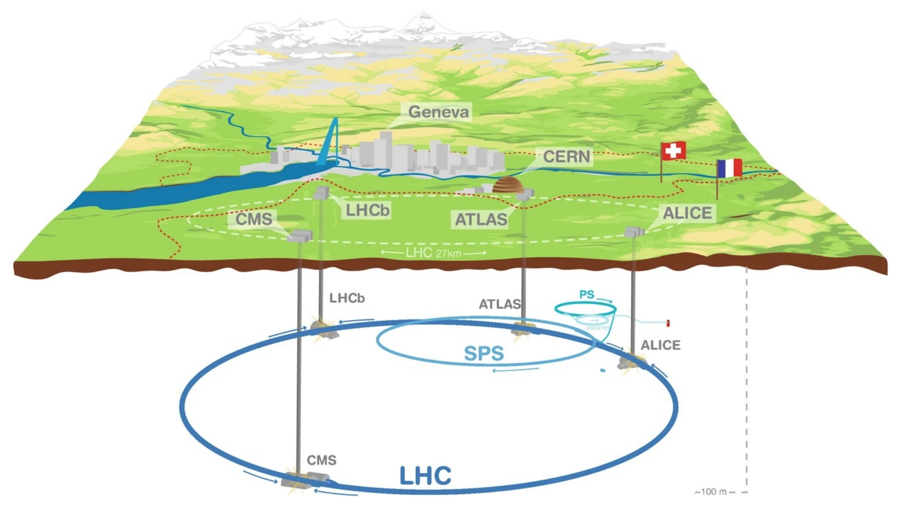
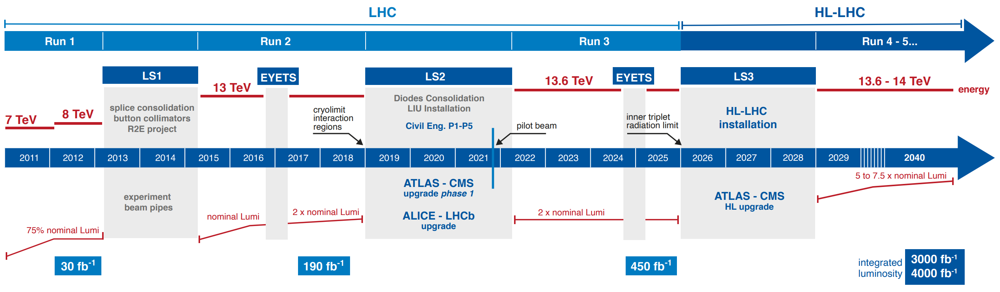
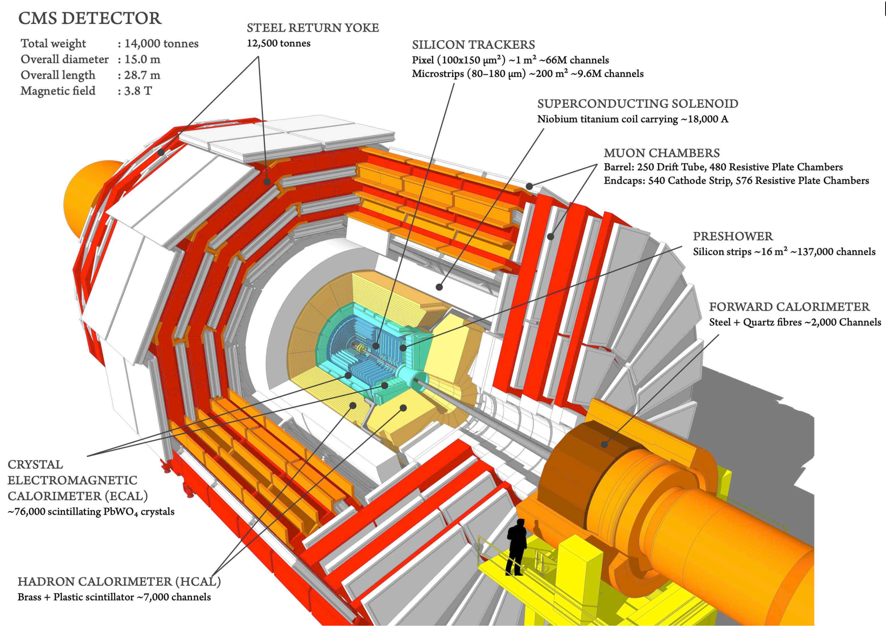
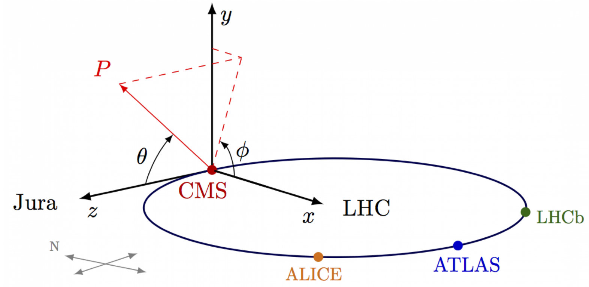
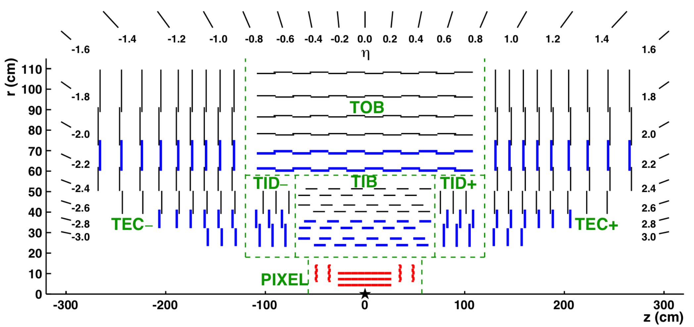
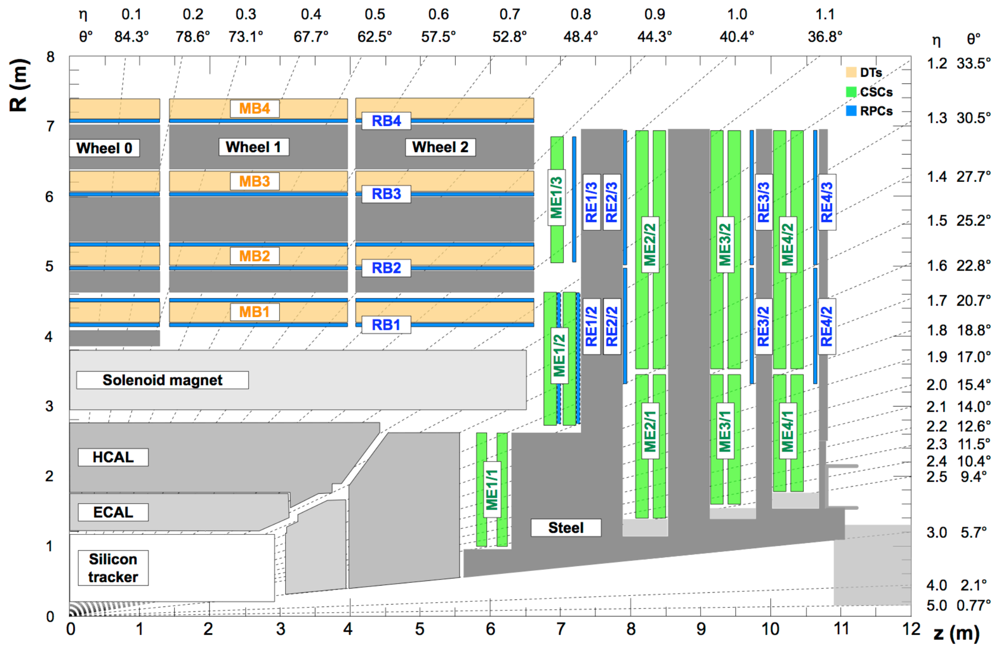
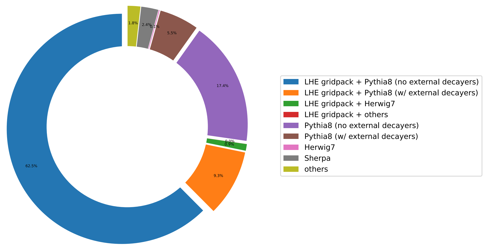
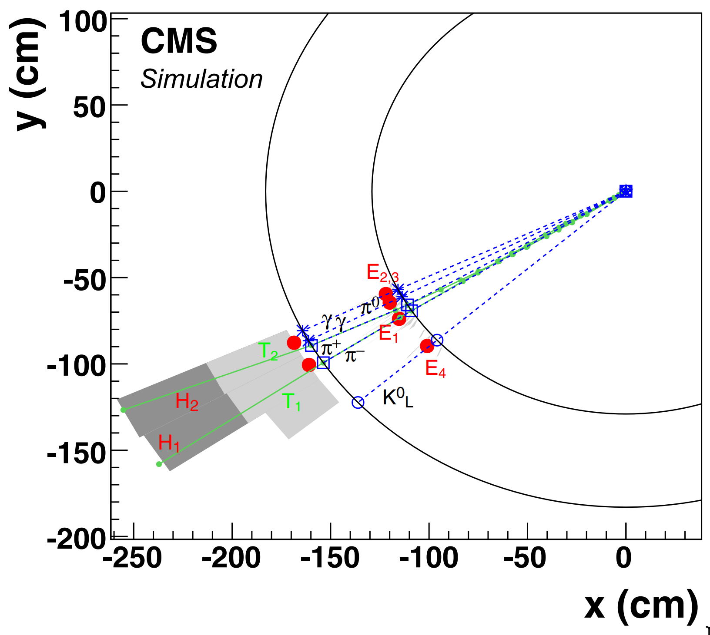
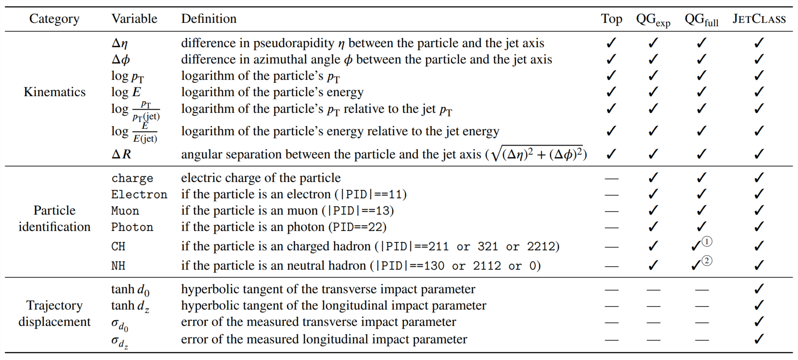

### Modern deep learning for large-$R$ jet tagging --- algorithms, calibration methods, and applications in the CMS experiment

- Author: Congqiao Li
- Supervisor: Prof. Qiang Li
- Award: CMS Ph.D. Thesis Award 2024

HSE CS PhD School $\bullet$ Best Dissertations Course

19.03.2026

---

# CMS Ph.D. Thesis Award

- Recognizes and rewards excellence in Ph.D. thesis research yearly since year 2000
- Targets students who submitted their Ph.Ds the previous year between August 1 and July 31
- The theses are judged on their content, originality, clarity of writing, and impact within CMS and the high energy physics in general and can be written on any CMS-related work

 

---

# Authors

  

**Li, Congqiao**

PhD from Peking University, China

  

  

  

**Li, Qiang**

Professor, State Key Laboratory of Nuclear Physics and Technology,
Peking University, China

  

---

# Publications

Experimental publications with significant contributions

- CMS Collaboration, “Search for Higgs boson decay to a charm quark-antiquark pair in proton-proton collisions at $\sqrt s$ = 13 TeV”, Phys. Rev. Lett. 131, 061801 (2023), arXiv: 2205.05550 [hep-ex].
- MS Collaboration, “Performance of heavy-flavour jet identification in boosted topologies in proton-proton collisions at $\sqrt s$ = 13 TeV”, CMS Physics Analysis Summary CMS-PAS-BTV-22-001, 2022.

---

# Publications

Phenomenological research

- C. Li, et al., “Accelerating resonance searches via signature-oriented pre-training”, arXiv:
2405.12972 [hep-ph].
- C. Li, et al., “Does Lorentz-symmetric design boost network performance in jet physics?”,
Phys. Rev. D 109, 056003 (2024), arXiv: 2208.07814 [hep-ph].
- H. Qu, C. Li, and S. Qian, “Particle Transformer for Jet Tagging”, in International Con-
ference on Machine Learning, pp. 18281-18292. PMLR, 2022, arXiv: 2202.03772
[hep-ph].
- S. Gong, et al., “An efficient Lorentz equivariant graph neural network for jet tagging”, JHEP 07, 030 (2022), arXiv: 2201.08187 [hep-ph].
- C. Li, et al., “Loop-induced $ZZ$ production at the LHC: An improved description by
matrix-element matching”, Phys. Rev. D 102, 116003 (2020), arXiv: 2006.12860 [hep-ph].

---
layout: section
---

# Part I: Foundations

## Chapter 1. Physics

---

# Standard Model

History

1. Discovery of electron by J.J. Thomson in the 19th century, marking the divisibility of the atom.
2. Discovery of the nucleus in 1911 and neutron in 1932.
3. Emergence of quantum mechanics in the 1920s to describe atomic and subatomic processes.
4. Evolution of quantum mechanics into quantum field theory (QFT) in the 1940s.
5. Establishment of quantum electrodynamics (QED) in the 1940s, describing electromagnetic interactions within a quantum framework and integrated with special relativity.
6. Introduction of Yang-Mills theory in the 1950s, incorporating QFT with non-Abelian gauge group.
7. Formulation of quantum chromodynamics (QCD) in the 1960s and 1970s, describing strong interaction.
8. Explanation of particle mass acquisition through spontaneous symmetry breaking in gauge theories with Higgs mechanisms in the 1960s.
9. Introduction of the Standard Model (SM), a comprehensive theory unifying all known elementary particles and forces except for gravity.

---
layout: two-cols
---

# Standard Model

Key components of SM

* Higgs boson giving masses to other particles
* W and Z bosons as carriers of weak interaction
* Photon mediating electromagnetic force, remaining massless
* Gluon as massless boson mediating strong interaction
* Fermions as building blocks of matter, divided into quarks and leptons, constituting three generations

::right::

---

# Standard Model

Lagrangian

Built to respect $\text{SU}(3) \times \text{SU}(2) \times \text{U}(1)$ gauge symmetry.

$$
\mathcal L = -\frac14 F_{\mu\nu}^a F_a^{\mu\nu} + \bar\psi (i\gamma^\mu D_\mu - m) \psi + (y_{ij}\bar\psi_i\phi\psi_j + h.c.) + |D_\mu\phi|^2 - V(\phi)
$$

- The first term corresponds to the kinetic term for gauge field, where $F_{\mu\nu}$ is the field strength tensor that covers the electroweak force and the strong force
- The second term is the coupling of fermions, such as leptons and quarks, to the gauge field
- The third term characterizes the Yukawa coupling, and it describes the interaction of the fermion fields with the Higgs field
- The fourth term is the Higgs interaction with the boson field
- The fifth term is the Higgs field potential

---
layout: two-cols
---

# Standard Model

Lagrangian expanded form

We will use only relevant parts

::right::

---

# Feynman Diagram Vertices

---

# Standard Model

Higgs mechanism

Higgs field:

$$
\phi = \frac{1}{\sqrt2}\begin{pmatrix}
\phi^+\\
\phi^0
\end{pmatrix}, \quad \phi^{\bullet} \in \mathbb C
$$

Higgs potential:

$$
V(\phi) = \mu^2 \phi^\dagger \phi + \lambda (\phi^\dagger \phi)^2, \quad \mu^2 < 0, \lambda > 0
$$

Potential argmin (vaccum):

$$
\phi_{\text{vac}} = \frac{1}{\sqrt2}\begin{pmatrix}
0\\
v
\end{pmatrix}, \quad v = \sqrt{-\frac{\mu^2}{\lambda}}
$$

---

# Standard Model

Higgs mechanism

Rewrite Higgs field around $\phi_{\text{vac}}$

$$
\phi = \frac{1}{\sqrt2}\begin{pmatrix}
\phi_1^+ + i\phi_2^+\\
v + h + ia^0
\end{pmatrix}
$$

$\phi_1^+, \phi_2^+$, and $a^0$ are absorbed by the electroweak gauge fields, providing the necessary longitudinal
components for the $W^\pm$ and $Z$ bosons. This is the procedure through which they acquire masses.

$$
m_W^2 = \frac{g^2 v^2}{4}, \quad m_Z = \frac{(g^2 + g'^2) v^2}{4}
$$

$h$ is a physical Higgs boson (single scalar field degree of freedom) $m_H = v\sqrt{2\lambda}$.

---

# Standard Model

Higgs mechanism

After the electroweak symmetry
breaking, fermions gain mass through Yukawa interactions with the Higgs field:

$$
m_f = \frac{1}{\sqrt2}v y_f,
$$

where $y_f$ is the corresponding Yukawa coupling strength.

Part IV in this
dissertation focuses on the measurement of the Yukawa coupling between the Higgs boson
and the charm quark, $y_c$.

---

# LHC Higgs Boson Production

Proton-proton collisions

- **Gluon fusion (ggF)** (a). The most dominant Higgs production mode at the LHC involves the
fusion of two gluons mediated by a virtual quark loop;
- **Vector boson fusion (VBF)** (b). The VBF process produces a Higgs boson through the interaction of two vector bosons, which are emitted by quarks. The process
is characterized by the jets induced from the emitted quarks being widely separated in pseudorapidity $\eta$ and having a large invariant mass;
- **Higgs boson production associated with a vector boson $\left( V\!H \right)$** \(c\). The Higgs boson can be produced in association with a vector boson $W$ or $Z$, denoted by $V\!H$.
The emitted vector boson can provide a triggering of the Higgs boson to facilitate the experimental search. This production channel is the main research target in the physics measurement
discussed in Part IV;
- **Higgs boson production associated with a top quark-antiquark pair $\left( t\bar tH \right)$** (d). The $t\bar tH$ process involves the Higgs boson production in association with a top quark-antiquark pair. It is notable for its lower cross section owing to the substantial
mass of the resulting particles.

---

# Higgs Boson Decay

1. **Decays to Vector Bosons** (g):
	* Forbidden to decay into on-shell vector bosons due to mass constraints.
	* Decay to off-shell $WW^*$ and $ZZ^*$ pairs is considerable.
	* Important role in LHC due to a clean experimental signature in the four-lepton final state (Z boson pair).
3. **Decays to Fermions** (h):
	* Direct Yukawa coupling to fermions.
	* Proportional to fermion mass, significant for decays to first-generation fermions ($b\bar b$ and $\tau^+ \tau^-$ pairs).
	* Predominant but challenging to isolate in hadron collider environments.
4. **Loop-Induced Decay Processes** (i, j):
	* Decay into massless particles, including gluons and photons, through a loop-induced process.
	* Higgs boson to gg decay takes up considerable proportion but direct measurement is difficult.
	* Higgs boson decaying to diphoton (Higgs to $\gamma\gamma$) provides clear modelling of a peak structure on the diphoton invariant mass and is a golden channel to probe the Higgs boson at LHC.

---

# Feynman Diagram Vertices

Proton-proton collisions

<!--
### Production

- **Gluon fusion (ggF)** (a). The most dominant Higgs production mode at the LHC involves the
fusion of two gluons mediated by a virtual quark loop;
- **Vector boson fusion (VBF)** (b). The VBF process produces a Higgs boson through the interaction of two vector bosons, which are emitted by quarks. The process
is characterized by the jets induced from the emitted quarks being widely separated in pseudorapidity $\eta$ and having a large invariant mass;
- **Higgs boson production associated with a vector boson $\left( V\!H \right)$** \(c\). The Higgs boson can be produced in association with a vector boson $W$ or $Z$, denoted by $V\!H$.
The emitted vector boson can provide a triggering of the Higgs boson to facilitate the experimental search. This production channel is the main research target in the physics measurement
discussed in Part IV;
- **Higgs boson production associated with a top quark-antiquark pair $\left( t\bar tH \right)$** (d). The $t\bar tH$ process involves the Higgs boson production in association with a top quark-antiquark pair. It is notable for its lower cross section owing to the substantial
mass of the resulting particles.

### Decay

1. **Decays to Vector Bosons** (g):
	* Forbidden to decay into on-shell vector bosons due to mass constraints.
	* Decay to off-shell $WW^*$ and $ZZ^*$ pairs is considerable.
	* Important role in LHC due to a clean experimental signature in the four-lepton final state (Z boson pair).
3. **Decays to Fermions** (h):
	* Direct Yukawa coupling to fermions.
	* Proportional to fermion mass, significant for decays to first-generation fermions ($b\bar b$ and $\tau^+ \tau^-$ pairs).
	* Predominant but challenging to isolate in hadron collider environments.
4. **Loop-Induced Decay Processes** (i, j):
	* Decay into massless particles, including gluons and photons, through a loop-induced process.
	* Higgs boson to gg decay takes up considerable proportion but direct measurement is difficult.
	* Higgs boson decaying to diphoton (Higgs to $\gamma\gamma$) provides clear modelling of a peak structure on the diphoton invariant mass and is a golden channel to probe the Higgs boson at LHC.
-->

---

The Higgs boson production cross sections in various production modes as a function of the centre-of-mass energy (left), and the branching functions as a function of the
Higgs boson mass (right).

<!--
Cross section ($\sigma$) is a measurement of the probability that an event occurs.

It's measured in “barn” – 1 b = $10^{-24} \text{cm}^2$

Branching fractions (or ratios) at the
Large Hadron Collider (LHC) define the probability of a specific particle decay channel
-->

---

# LHC Overview

LHC facilities

<!--
1. The LHC is the world's largest, highest-energy particle accelerator located on the border of Switzerland and France, spanning 27 km.
2. It is designed to reach collision energies of 14 TeV, equivalent to protons traveling at 99.9999991% of light speed.
3. LHC's proton acceleration achieved through multiple stages, including Linac 2, Proton Synchrotron Booster (PSB), Proton Synchrotron (PS), Super Proton Synchrotron (SPS), and the final injection into LHC's vacuum tubes.
4. Increased probability of proton collisions by squeezing protons into small spaces, leading to proton bunch collisions every 25 nanoseconds or at a frequency of 40 MHz.
5. Proton collisions occur at four particle detectors: ATLAS, CMS, ALICE, and LHCb.
6. ALICE studies quark-gluon plasma at extreme energy densities. LHCb explores the differences between matter and antimatter through b-quark physics. ATLAS and CMS are general-purpose detectors with the same research scope and physical objectives.
-->

---

# LHC Overview

LHC Timeline

<!--
1. LHC physics goals include SM studies, Higgs boson properties, and BSM signature searches such as dark matter, supersymmetry, and extra dimensions, testing particle physics theories.
2. The discovery of the Higgs boson in 2012 by ATLAS and CMS is a major success for LHC programs.
3. LHC has operated through various phases: Run 1 (2009-2013) at 7-8 TeV, Run 2 (2015-2018) at 13 TeV with an integrated luminosity of around 140 fb-1.
4. In progress is the Run 3 period (2022-2025), featuring increased luminosity and energy of 13.6 TeV, peak luminosity reaching 2 × 10^34 cm^-2s^-1.
5. High-Luminosity LHC (HL-LHC) is a planned upgrade starting in 2029 after Long Shutdown 3 (LS3), aiming to significantly increase luminosity by up to 10x and extend operational life to 2041. Figure 1.6 displays the timeline for LHC and HL-LHC programs.
-->

---

# CMS Overview

<!--
1. The CMS detector, located in Cessy, France, is one of two general-purpose LHC detectors focused on precision SM measurements and new physics searches.
2. The CMS detector's dimensions are 21 m long, 15 m in diameter, and weighs about 14000 tons.
3. It comprises several subdetectors: silicon pixel detector, silicon stripe detector, electromagnetic calorimeter, hadron calorimeter, and muon system.
5. Each subdetector consists of small hardware units covering the collision point region, except for the muon system and part of the hadron calorimeter.
6. Subdetectors are housed within a superconducting solenoid at 3.8 T, apart from the muon system and some of the hadron calorimeter.
7. When charged particles pass through the trackers, a strong magnetic field causes curved trajectories, enabling precise particle momentum measurements.
-->

---

# CMS Overview

Coordinate System

Pseudorapidity $\eta$ represents the angle of a particle relative to the beam axis:

$$
\eta \equiv -\ln\left[\tan\left(\frac{\theta}{2}\right)\right]
$$

<!--
CMS coordinate system The CMS experiment uses a right-handed coordinate system. In
this system, the origin lies in the nominal interaction point. The $z$ axis runs counterclockwise along the beam direction and the $x$-$y$ plane is the transverse plane. The $x$ axis points
to the centre of the LHC ring, and the $y$ axis points upward. The $\phi$ and $r$ characterize the
azimuthal angle and the radial coordinate on the $x$-$y$ plane.
-->

---

# CMS Overview

Inner Tracker

<!--
1. The Inner Tracking System measures charged particle trajectories, divided into silicon pixel and strip detectors. It covers |η| < 2.4, with a material thickness of 0.4X0 to 1.0X0.
2. Silicon pixel detector: 1 m2 surface area with 66 million pixels; 0.0174 × 0.0174 size on (η, φ) space.
3. Silicon strip tracker: 200m2 with 9.6 × 106 strips; divided into inner barrel (TIB), inner disks (TID), outer barrel (TOB), and outer end-caps (TEC).
4. Pixel detector was upgraded during the LHC's year-end technical stop in 2016-2017, adding a new pixel layer in the barrel and endcap sections, increasing coverage to |η| = 3.
5. Electromagnetic Calorimeter (ECAL): Lead tungstate crystals measure electron and photon energies; relative energy resolution σ/E of 2.8%√E/GeV ⊕ 12%E/GeV ⊕ 0.3%.
6. ECAL has a preshower detector with superior granularity in front of endcaps for photon and neutral pion separation.
7. Hadron Calorimeter (HCAL): Brass absorber and plastic scintillator layers measure outgoing hadron energies; HCAL covers |η| < 1.3 (barrel) and 1.3 < |η| < 3.0 (endcaps), with coarse segmentation in the (η, φ) space.
8. ECAL and HCAL energy resolution for pions is σ/E = 110%E/GeV ⊕ 9%.
-->

---

# CMS Overview

Muon Chambers

<!--
9. Muon Chambers: CMS has the best muon identification system at LHC; dedicated muon system uses Drift Tube (DT) chambers, Cathode Strip Chambers (CSC), and Resistive Plate Chambers (RPC). DT used for precise trajectory measurements in the central barrel region, while CSC is used in endcaps.
10. Trigger and Data Acquisition: LHC collision rate of 40 MHz results in a data output of 15 PB per year; CMS trigger system reduces event rates to less than 100 kHz for final storage. The Level-1 trigger (L1T) uses custom hardware processors, and the high-level trigger (HLT) further reduces L1-accepted rate using large computing farms.
-->

---

# CMS Event Generation

- Monte Carlo (MC) simulations are crucial in CMS to compare collected data with Standard Model predictions.
- MC simulations numerically estimate observables by sampling pseudorandom numbers and approximating integrals.

<!--
In the CMS experiment, Monte Carlo (MC) simulations are used to model phenomena expected in the detector, particularly when analytical solutions are not feasible due to complexity. MC simulations involve sampling pseudorandom numbers according to phase space and using the acceptance-rejection method to approximate integrals.
-->

---

# CMS Event Generation

- Event generators are used for exclusive collision event generation and handle both hard-scattering processes and parton showering.
- Parton showering is handled by dedicated phenomenological models, such as PYTHIA or HERWIG, which simulate non-perturbative QCD effects at low energy scales.
- The CMS software framework integrates various event generators using multithread computing utilities.
- The detector effect is delivered by an MC simulation toolkit, GEANT4, which simulates the interaction of hadronized particles with detector material.
- Pileup is simulated by generating inelastic events with PYTHIA, proceeding to GEANT4 for detector simulation, and then superimposing on the simulated hard-scattering event.

<!--
The CMS workflow for MC simulations includes event generators for exclusive collision event generation, which simulate both hard-scattering processes and parton showering. Commonly used event generators in CMS are MADGRAPH5_aMC@NLO and POWHEG. Parton showering is handled by dedicated phenomenological models such as PYTHIA or HERWIG, which simulate non-perturbative QCD effects at low energy scales and can compute simpler processes at LO accuracy. The CMS software (CMSSW) framework integrates various event generators using multithread computing utilities.

The detector effect is delivered by an MC simulation toolkit, GEANT4, which simulates the interaction of hadronized particles with detector material and integrates the effect of pileup. Pileup can be induced from the same bunch crossing (in-time pileup) or adjacent bunch crossings (out-of-time pileup) and is superimposed on the simulated hard-scattering event in the simulation.
-->

---
layout: two-cols
---

# CMS Event Reconstruction

- Event reconstruction in CMS transforms raw detector data into meaningful physics objects like electrons, muons, photons, and jets for effective analysis of particle collisions.
- The Particle-flow (PF) algorithm lies at the core of CMS event reconstruction, combining information from all subdetectors to identify and reconstruct individual particles within each event, leading to PF candidates providing a global description of the event.

::right::

<!--
1.5 CMS Event Reconstruction

Event reconstruction in the CMS experiment transforms raw detector data into meaningful physics objects like electrons, muons, photons, and jets for effective analysis of particle collisions. The Particle-Flow (PF) algorithm lies at the core of CMS event reconstruction, combining information from all subdetectors to identify and reconstruct individual particles within each event, resulting in PF candidates that provide a global description of the event.

1.5.1 Particle-flow candidate:

PF candidates are unified objects representing reconstructed particles, serving as fundamental building blocks for jet reconstruction and providing input features for deep learning-based jet processing. They are constructed using the PF algorithm, which integrates information from all subdetectors. Track reconstruction in the inner tracker (including electron and muon tracks) and calorimeter clusters in electromagnetic and hadronic calorimeters are essential components of this process.

An event display of a toy jet initiated by two charged particles 𝜋+ and 𝜋−, one
neutral hadron 𝐾0
𝐿, and two photons from the 𝜋0 decay, shown in the (𝑥 𝑦) coordinate[31]. The
symbols T1,2, E1,2,3,4 and H1,2 represent tracks and energy deposit in ECAL and HCAL measured
by the CMS subdetectors corresponding to these particles.
-->

---

# CMS Event Reconstruction

- Reconstruction processes for electrons, muons, secondary vertices (SVs), jets, and missing transverse momentum are carried out using the PF candidates as input features.
- GEN-jets produced from stable hadronized particles serve as truth-level references for jets in the development of jet tagging tools.
- Track reconstruction is crucial for understanding particle trajectories, their origins, and properties like momentum and direction, utilizing a Kalman Filtering (KF) based combinatorial track finder that operates in three main stages: initial seed generation, trajectory building, and final fitting.
- Calorimeter clusters reconstruction measures the energy and direction of stable neutral particles such as photons and neutral hadrons, distinguishing these neutral particles from charged particle energy deposits.
- PF elements are linked through a set of specific conditions, resulting in PF blocks including PF elements related directly or indirectly, forming the final PF candidates as a global event description.

<!--
1.5.2 Muons:

Muon candidates are selected based on global and tracker muons with additional criteria, such as isolated global muons and those inside a jet. Selection requirements include momentum determination using the inner track's pT for low-momentum muons or lowest χ2 probability among various track fits for high-momentum muons.

1.5.3 Electrons:

Electron candidates originate from a GSF track if its associated ECAL cluster is not connected to three or more tracks. The candidate includes ECAL clusters, linked tracks, and converted photon contributions. Electron identification involves isolation requirements and energy deposit evaluation. The final electron energy and direction are obtained by combining the corrected ECAL energy with the momentum of the GSF track and choosing the direction of the GSF track.

1.5.4 Secondary Vertices (SVs):

Secondary vertices can indicate commonality of displaced tracks, useful for identifying jets initiated from heavy-flavour hadrons. The Inclusive Vertex Finding (IVF) algorithm reconstructs SVs using all reconstructed tracks in an event with loose criteria as input. The algorithm identifies seed tracks, performs track clustering and fitting, conducts track arbitration, and refits and cleans the SVs.
-->

---

# Anti-kt Algorithm

1. The anti-$k_T$ jet clustering algorithm, a widely used sequential recombination jet finding approach, begins by assigning each input particle or object (constituents) as an initial "jet" with zero radius and zero transverse momentum (pT).
2. In each step of the iterative procedure, the algorithm computes the pair-wise distance between every pair of jets/particles, following a specific metric. The anti-$k_T$ algorithm employs the Cambridge/Aachen or "$k_T$" clustering metric with an additional parameter R, the distance parameter.
3. For each pair of particles $(i,j)$, the algorithm computes the anti-$k_T$ distance using the following formula:
$$
d_{ij} = \min(p_{T,i}^{-2}, p_{T,j}^{-2}) \frac{\Delta R_{ij}^2}{R^2}
$$
where $p_{T,i}, p_{T,j}$ are transverse momenta of particles $i$ and $j$, and $\Delta R$ is the distance between them in the rapidity-azimuthal angle space $\Delta R = \sqrt{\Delta y^2 + \Delta \phi^2}$.

<!--
In summary, the anti-$k_T$ algorithm merges particles with the smallest pairwise distance in each iteration until no remaining pairs fall below a specified distance threshold. This process results in well-defined and collimated jets that follow the initial parton direction closely.
-->

---

# Anti-kt Algorithm

4. In each iteration, the pair with the smallest distance $d_{ij}$ is merged using an exclusive "winner-takes-all" strategy where the four-momentum of the combined jet is updated as follows:
$$
\begin{aligned}
p_{T,\text{new jet}} &= p_{T,i} + p_{T,j}\\
\eta_{\text{new jet}} &= (p_{T,i} \cdot \eta_i + p_{T,j} \cdot \eta_j) / p_{T,\text{new jet}}\\
\psi_{\text{new jet}} &= (p_{T,i} \cdot \phi_i + p_{T,j} \cdot \phi_j) / p_{T,\text{new jet}}
\end{aligned}
$$
where $\eta$ and $\phi$ are the pseudorapidity and azimuthal angle, respectively. The combined jet then takes the place of the two initial jets/particles in subsequent iterations.

5. The algorithm continues to merge pairs of particles or jets until there are no remaining pairs below a certain distance threshold (e.g., $d_{ij} < R^2 \cdot p_{T,\min}^2$, where $p_{T,\min}$ is a user-defined parameter). At this point, the remaining objects/particles are declared as jets.
6. A smaller R value in anti-$k_T$ leads to more collimated jets, while a larger R results in broader jets that capture more of the event's radiation.

<!--
The anti-$k_T$ algorithm tends to form narrow and collimated jets that follow the original parton direction better than other jet finding algorithms like the Cambridge/Aachen (CA) or $k_T$ algorithm.
-->

---

# Jets

1. Jets are clustered from PF candidates using the anti-$k_T$ algorithm with a distance parameter R. Small-R jet collection (AK4 jets) results from R = 0.4, and large-R jet collections (AK8 or AK15 jets) use customizable parameters, such as R = 0.8 or 1.5 for specific analyses.
2. Pileup mitigation is achieved using the charged hadron subtraction algorithm for AK4 jets and the pileup per-particle identification (PUPPI) algorithm for AK8 or AK15 jets, which involve removing and correcting energy from pileup particles based on jet area and constituent probabilities.
3. The soft drop algorithm is applied to large-R jets to acquire the soft-drop mass by removing soft radiation patterns within the jet progressively using a reversed merging history of the clustering tree and splitting criteria (β = 0, zcut = 0.1, and R = 0.8 or 1.5 for AK8 and AK15 jets).
4. The soft-drop mass is designated as the invariant mass of two subjets resulting from the procedure that stops when splitting criteria are met.

<!--
The soft drop algorithm[37-39] is applied to each large-𝑅 jet to acquire the soft-drop mass
in a procedure to remove the soft radiation patterns within the jet progressively. This algorithm
first decluster a jet into its constituents and recluster them using the Cambridge/Aachen clus-
22
Chapter 1 Experimental Particle Physics
tering algorithm. This algorithm is similar to the anti-𝑘T one, except that the power index in
Eqs. (1.10, 1.11) on 𝑝T is changed from -2 to 0. This results in a clustering tree that represents
the merging history of the constituents. An iterative procedure runs on the reversed merging
history to split one constituent into two; for each splitting, the criteria
is examined, with 𝛽 = 0 and 𝑧cut = 0.1, and 𝑅 = 0.8 or 1.5 for AK8 and AK15 jets. If
the criteria are failed, it indicates that one branch is comparable soft and is discarded, and the
procedure continues with the remaining branch. The procedure stops until the requirement
is satisfied; the remaining two branches are considered two subjets of the given net, and the
soft-drop mass is designated as the invariant mass of two subjets
-->

---

# Jet Matching

- Two types of GEN-jets are clustered from PYTHIA particles with anti-$k_T$ algorithm and R=0.8 or 1.5: "no-ν" (excluding neutrinos) and "with-ν" (including neutrinos).
- The default configuration is "no-ν", serving as a reference for reconstruction accuracy.
- Soft drop algorithm is applied to both GEN-jet collections, matching the handling of reconstructed-level jets.
- A standard CMS convention is used for matching large-R jet collection to "no-ν" and "with-ν" GEN-jet collections, requiring ΔR < R0 between a jet and its matched GEN-jet.
- Some jets may not have a matched GEN-jet after the procedure.
- The soft-drop mass for each jet is determined as the mass of the matched GEN-jet from "no-ν" or "with-ν" collections.

<!--
The GEN-jets are clustered from all stable final particles generated by PYTHIA, with the
anti-𝑘T algorithm and 𝑅 = 0.8 or 1.5. Two cases are considered, one in which the neutrinos are
excluded from the particle list (denoted as “no-𝜈”), and another without the exclusion (denoted
as “with-𝜈”). The former is the default configuration, and the clustered GEN-jets provide a
reference for the reconstruction accuracy. For both cases, a soft drop algorithm with the same
settings as described above is adopted to mimic our handling of the reconstructed-level jets.
The “no-𝜈” and “with-𝜈” GEN-jet collections after soft-drop are matched to the large-
𝑅 jet collection using the standard CMS convention. To perform the matching, each jet is
matched with the GEN-jet with the smallest Δ𝑅 with the jet, also requiring Δ𝑅 < 𝑅0. This
matching process is carried out for each jet, following a sequence sorted by decreasing jet 𝑝T.
Some jets may have no matched GEN-jet after this procedure. The “no-𝜈” and “with-𝜈” GEN-
jet soft-drop mass for each jet is determined as the mass of the matched GEN-jet for the two
collections.
-->

---
layout: section
---

# Part I: Foundations

## Chapter 2. Deep Learning

---

# HEP Datasets

1. High-energy physics domain has mostly labeled public datasets
2. Datasets come from simulated events using MC event generators for hard-scattering processes
3. DELPHES used for fast simulation of detector effects and reconstruction of common analysis-level objects
4. DELPHES useful for phenomenological studies and deep learning
5. Stable particles propagated through detectors configured with the DELPHES card
6. Particles interacted with tracker, ECAL, and HCAL modules to build charged-particle tracks and calorimeter towers
7. Tracks and towers merged into E-flow object collection, considered reconstructed particles using all detector information
8. Jets clustered from E-flow objects with jet clustering algorithm
9. Jet samples constitute the jet tagging dataset.

<!--
Unlike the CV and NLP domains, where unlabelled datasets are most common and abun
dant, public datasets in the high-energy physics domain mostly come from simulated events
that are naturally labelled. These datasets are simulated with MC event generators for hard-
scattering process and DELPHES[63] for fast simulation of detector effects and reconstruction of
common analysis-level objects. DELPHES is incredibly useful for delivering phenomenological
studies in LHC physics and deep learning. In DELPHES, stable particles produced by event gen-
erators are propagated through the detectors configured with the DELPHES card and interacted
with the tracker, ECAL and HCAL modules sequentially to build charged-particle tracks and
calorimeter towers with simplified algorithms, based on predefined detector geometry, granu-
larity and resolution, etc. The processed tracks and towers are merged into the E-flow object
collection, which is considered the reconstructed particles using all the detector information, in
analogy with the PF candidates in the CMS experiment. Jets are clustered from E-flow objects
with the jet clustering algorithm, and they constitute the samples in the jet tagging dataset.
-->

---

# Jet Tagging Datasets

Top tagging dataset

* Includes 1.2M jets for training, 0.4M for validation, and 0.4M for testing
* Two sets of large-R jets initiated from top quark and QCD multijet events
* Generated by PYTHIA8 and passed to DELPHES for detector simulation
* Jets clustered with anti-kT algorithm (R = 0.8)
* Includes kinematics information of jet constituents with up to 200 highest pT constituents

---

# Jet Tagging Datasets

Quark-gluon tagging dataset

* Includes 1.6M jets for training, 0.2M for validation, and 0.2M for testing
* Two sets of small-R jets initiated from Z(→νν) + u/d/s and Z(→νν) + g events
* Generated by PYTHIA v8 and clustered with anti-kT algorithm (R = 0.4)
* Includes kinematics information of jet constituents and particle identification (PID) information
* PID varies from 8 types, including electrons, muons, photons, charged hadrons, and neutral hadrons

---

# Jet Tagging Datasets

JetClass dataset

* Large dataset comprising 100M for training, 20M for validation, and 20M for testing
* Composed of ten classes of large-R jets, including Higgs boson decay modes, top quark decays, W/Z bosons, and QCD events
* Generated by MG for resonance production and decay, then PYTHIA v8 for parton showering and DELPHES for detector simulation
* Jets clustered with R = 0.8 and input features include kinematics information, particle identification flags, and trajectory displacement features
4. Recommended metrics for JetClass dataset: binary background rejection evaluating the ability to separate two certain classes (S vs B) using a discriminant score(A) / (score(A) + score(B)).

---

# Jet Tagging Datasets

Detailed Comparison

---
layout: section
---

# Part II: Algorithms for Jet Tagging

## Chapter 3: Algorithm Overview

---

# Algorithm Overview

Three generations of jet tagging algorithms

1. **Rule-based algorithms** — hand-crafted physics variables exploiting jet substructure and heavy-flavour properties
2. **Shallow machine-learning algorithms** — multivariate analyses (BDT, MLP) combining high-level features
3. **Deep learning algorithms** — DNNs operating directly on low-level particle features

<!--
Jet tagging aims to identify a jet's origin using the available properties associated with a jet.
Developing algorithms for large-R jet tagging is more challenging due to the larger complexity
of the jet constituent particles and the diversity in the structure.
In the modern deep learning era, new opportunities arise when one can dive deep into the
low-level particle features and use an advanced neural network to explore the comprehensive
relations among the input features and different particles.
-->

---

# Rule-based Algorithms

Jet grooming

* **Goal**: remove soft emissions from pileup or underlying events that smear the jet mass
* Four algorithms explored in CMS and ATLAS: **jet trimming**, **jet pruning**, **jet filtering**, and **soft drop**
* All techniques recluster jet constituents into subjets to identify and remove soft components
* The **soft drop algorithm** (mMDT) is most frequently used in CMS
  - Declusters the jet and removes subjets failing a soft radiation criterion
  - Can be combined with multivariate analysis or likelihood fit for signal extraction

<!--
Jet grooming techniques, initiated a decade ago, particularly aid in mass reconstruction
when the large-R jet is initiated from a resonance. These techniques aim to remove
soft emissions within a jet that come from the pileup or underlying events.
-->

---

# Rule-based Algorithms

Jet substructure: $N$-subjettiness

* $N$-subjettiness $\tau_N$ measures how well a jet can be described by $N$ subjets:

$$\tau_N = \frac{1}{d_0} \sum_{i=1}^{M} p_{T,i} \min\{\Delta R_{i,\text{sj}_1}, \Delta R_{i,\text{sj}_2}, \ldots, \Delta R_{i,\text{sj}_N}\}, \quad d_0 = \sum_{i=1}^{M} p_{T,i} R_\text{jet}$$

  where $d_0$ is the normalization factor, $M$ is the number of jet constituents, and $R_\text{jet}$ is the jet radius

* The ratio $\tau_{NM} = \tau_N / \tau_M$ optimizes separation between jet classes
  - $\tau_{21}$: tags 2-prong $W/Z/H$ jets vs QCD multijet background
  - $\tau_{32}$: identifies 3-prong hadronically decayed top jets
* **Energy correlation functions (ECFs)**: probe energy distribution without subjet axes reconstruction
  - Generalized ECF ratios (e.g. $N_2$) widely used for 2-prong jet tagging in CMS
  - Can be combined in multivariate approach for better discrimination

---

# Rule-based Algorithms

Heavy-flavour jet properties

* $b$ and $c$ quarks form hadrons with **longer lifetimes** → displaced decay tracks from the primary vertex (PV)
* Key discriminating features:
  - **Displaced tracks**: track impact parameter significance
  - **Secondary vertices (SV)**: reconstructed from displaced tracks, including SV mass, number of tracks, azimuthal relation to jet
  - **Soft leptons**: nonprompt low-$p_T$ leptons from $b/c$ hadron decays
* CMS algorithms (JP, JBP) use track impact parameter to build jet $b$-probability
* These techniques extend to large-$R$ jets for tagging $H \to bb$ or $H \to cc$ signatures

---

# Shallow Machine-Learning Algorithms

Multivariate approaches combining high-level features

* Combine hand-crafted variables (jet substructure, $b$-tagging properties) via BDT or shallow MLP
* **Boosted Event Shape Tagger (BEST)**: multi-class classifier ($W/Z/H/t$ jets and QCD)
  - Inputs: jet kinematics, $m_\text{SD}$, $b$-tagging properties, subjet invariant masses, sphericity
  - Variables computed in multiple Lorentz-boosted rest frames
* These approaches offer improvements but are limited by the quality of hand-crafted features

---

# Deep Learning Algorithms

Jet representation of images and sequences

* **Jet images** (CNN): project jet onto 2D $\eta$-$\phi$ grid or 1D sequence ordered by $p_T$
  - **ImageTop** (CMS): rasterize top-jet particles into image + subjet $b$-tag network
  - **DeepAK8** (CMS): 1D CNN on particle sequence, later combined with RNN
* **DeepDoubleX** (CMS): combined CNN and GRU architecture for $X \to bb/cc$ tagging
* **Limitations**:
  - Jet images are sparse — many empty pixels
  - Sequential representations require a predefined ordering, conflicting with the inherent permutation symmetry of jet particles

---

# Deep Learning Algorithms

Jet representation of sets and graphs

* Jets as **unordered sets** (point clouds) or **graphs** — respects permutation invariance
* **Particle Flow Network (PFN)**: per-particle MLP embedding followed by global pooling
* **ParticleNet**: based on Dynamic Graph CNN (DGCNN)
  - Dynamically connects each particle to its $k$ nearest neighbours in $\eta$-$\phi$ space
  - Efficiently extracts local features through EdgeConv operations
  - Achieves major performance gains in CMS for $W/Z/H/t$ and $X \to bb/cc$ tagging
* ParticleNet marks a turning point: **the choice of data representation is critical** for efficient and performant DNN design

---
layout: section
---

# Part II: Algorithms for Jet Tagging

## Chapter 4: New Advances in Deep Learning Algorithms

---

# New Advances in Deep Learning Algorithms

Two key insights driving progress

1. **Incorporating Lorentz symmetry**: respecting the intrinsic symmetries of jet data as an inductive bias improves both performance and robustness
2. **Transformer architectures**: Transformers, originally developed for NLP, offer superior expressiveness and scalability for jet tagging

<!--
The community for jet tagging using DNNs has widely recognized that sets (point clouds) or
graphs are more effective for representing particle-format data. Chapter 4 highlights new
insights in deep learning algorithms developed for jet tagging, after this phase of progress.
The topic will be brought up from two aspects, the consideration of symmetry preservation
within the network design, and the advances driven by the new architecture, Transformers.
-->

---

# Algorithms Preserving Lorentz Symmetry

Symmetry preservation as inductive bias

* **Principle**: if a dataset has inherent symmetries, designing the network to respect those symmetries:
  - Improves robustness to input transformations
  - Can improve performance especially under data-constrained conditions
* For jet data, permutation symmetry → use set/graph representation (already adopted)
* Additional Lorentz symmetries on top of basic $z$-$t$ boost and $x$-$y$ rotation:

| Transformation | Description |
|---|---|
| $y$-$z$ rotation | ≈ rotation in $\eta$-$\phi$ plane |
| $x$-$t$ boost | ≈ boost along the jet axis |
| $z$-tilt | mixture of $z$-$t$ boost with $x$-$z$ rotation |
| $y$-tilt | mixture of $y$-$t$ boost with $y$-$z$ rotation |

---

# LorentzNet

Architecture: Lorentz Group Equivariant Block (LGEB)

* Fully connected GNN with **Lorentz-invariant** scalar edge features and **Lorentz-equivariant** vector node features
* Each LGEB performs three sequential updates using Minkowski inner products:
  1. **Edge feature update**: $m^l_{ij} = \phi_e(h^l_i, h^l_j, \psi((x^l_i - x^l_j)^2), \psi(x^l_i \cdot x^l_j))$
  2. **Vector node update**: $x^{l+1}_i = x^l_i + c \sum_{j \in \mathcal{N}(i)} \phi_x(m^l_{ij}) \cdot x^l_j$
  3. **Scalar node update**: $h^{l+1}_i = h^l_i + \phi_h(h^l_i, \sum_{j \in \mathcal{N}(i)} w_{ij} m^l_{ij})$
* 6 stacked LGEBs, followed by average pooling and MLP decoder
* By construction, outputs are invariant to all Lorentz transformations

---

# LorentzNet

Performance and robustness

* Benchmarked on Top, QG, and JetClass datasets
* **Surpasses ParticleNet** by a large margin on Top and QG datasets
* Demonstrates **robustness** to Lorentz boosts: accuracy remains constant when input jets undergo $x$-$t$ boost with parameter $\beta = v/c$, while other models (ParticleNet, PFN) show performance drops
* On JetClass (100 M samples), LorentzNet accuracy = 0.855, outperforming ParticleNet (0.844) and ParT-plain (0.849)

<!--
The performance of LorentzNet is benchmarked on the Top and QG datasets. It achieves
superior performance, surpassing ParticleNet by a large margin. In addition, as LorentzNet
is built with full Lorentz symmetry preservation, studies show the performance remains
constant when jets undergo a Lorentz boost, while other algorithms manifest a performance drop.
-->

---

# Systematic Study: Preserving Lorentz Symmetry

Quantifying the effect of different pairwise features

Pairwise variables and their symmetry invariance:

| Variable | Lorentz-invariant? | Additional symmetries |
|---|---|---|
| $m^2_{ij} = (p_i + p_j)^2$ | ✓ (full Lorentz) | all 4 extra |
| $\Delta R_{ij}$ | ✓ ($z$-$t$, $x$-$y$) | $y$-$z$ rotation |
| $\Delta R_{ij}(p_{T,i}+p_{T,j})$ | ✓ ($z$-$t$, $x$-$y$, $y$-$z$) | $x$-$t$ boost |
| $E_{ij} = E_i + E_j$ | ✗ (violates basic symmetries) | — |

* **Key finding**: incorporating variables invariant under more symmetry types consistently improves performance
* Effect is **strongest with limited training data** — symmetry acts as effective data augmentation
* Confirmed on both Top and JetClass datasets across training sizes from 6k to 100M

---

# The Transformer Algorithm

Why Transformers for jet tagging?

* **Self-attention** naturally fits particle-format data:
  - Captures long-range dependencies between all pairs of particles (fully connected graph)
  - No predefined token ordering needed — particles are inherently permutation invariant
* **Scaling advantage**: Transformers improve more with larger datasets
  - At 2M samples: ParT ≈ ParticleNet performance
  - At 100M samples (JetClass): ParT dramatically outperforms ParticleNet

| Model | Training size | Accuracy | $H \to bb$ Rej50% |
|---|---|---|---|
| ParticleNet | 2M | 0.828 | 5540 |
| ParticleNet | 100M | 0.844 | 7634 |
| ParT | 2M | 0.836 | 5587 |
| ParT | 100M | **0.861** | **10638** |

---

# Particle Transformer (ParT)

Architecture overview

* **Backbone**: $L = 8$ Particle Attention Blocks + 2 Class Attention Blocks
* **Key innovation**: incorporates **pairwise features** as attentive bias in attention mechanism
* Pairwise features for particle pair $(i, j)$:
  - $\Delta R_{ij}$ — angular separation
  - $k_{T,ij} = \min(p_{T,i}, p_{T,j}) \Delta R_{ij}$ — $k_T$-type variable
  - $z_{ij} = \min(p_{T,i}, p_{T,j}) / (p_{T,i} + p_{T,j})$ — momentum fraction
  - $m^2_{ij} = (p_i + p_j)^2$ — pairwise invariant mass (fully Lorentz-invariant)
* Modified attention: $\text{P-MHA}(Q, K, V, U) = \text{softmax}\left(\frac{QK^T}{\sqrt{d}} + U\right) V$
  - $U$ is the embedded pairwise feature matrix — provides Lorentz-symmetry inductive bias

---

# Particle Transformer (ParT)

Performance comparison

| Model | Accuracy | AUC | Rej50% (top) | FLOPs |
|---|---|---|---|---|
| PFN | 0.772 | 0.9714 | 2924 | 4.62 M |
| ParticleNet | 0.844 | 0.9849 | 7634 | 540 M |
| LorentzNet | 0.855 | 0.9869 | 9217 | 2.01 G |
| ParT (plain) | 0.849 | 0.9859 | 9569 | 260 M |
| **ParT** | **0.861** | **0.9877** | **10638** | 340 M |

* ParT achieves **highest performance** with **moderate computational cost**
* ParT has 6× more parameters than ParticleNet but **similar FLOPs** — efficient Transformer design
* LorentzNet achieves high accuracy but with ~6× higher FLOPs than ParT due to fully-connected GNN

---

# Discussion: Future Directions in DNN Algorithms

Three potential directions for Transformer-based models

1. **Scaling**: investigate effect of scaling up model size on 100M+ datasets; explore whether larger data continues to improve performance → motivates work in Part V
2. **Multi-task capability**: leverage Transformers' large capacity to handle complex, multi-class, or multi-modal tasks → explored in GloParT (Part V)
3. **Efficiency improvement**:
   - Adopt efficient Transformer variants (linear attention, etc.)
   - Address quadratic complexity of pairwise feature computation (≈ 20% of ParT's compute)
   - Find alternative methods to incorporate Lorentz symmetry without full pairwise computation

---
layout: section
---

# Part III: Calibration of Jet Taggers

## Chapter 5: Introduction to Boosted-jet Flavour Tagger Calibration

---

# Why Calibration is Needed

The simulation-to-data discrepancy problem

* When a jet tagger is deployed in an LHC physics analysis, a **calibration** step is required
* DNN-based taggers are trained on simulated jets → may capture simulation-specific patterns not present in real data
* **Scale Factor (SF)**: ratio of tagging efficiency in data vs. simulation

$$\text{SF} = \frac{\epsilon_{\text{data}}}{\epsilon_{\text{MC}}}$$

* Deeper and more complex networks tend to **amplify** the data-simulation discrepancy
* SFs depend on the tagger working point, jet $p_T$, and data-taking conditions
* Focus of Part III: calibrating **boosted-jet flavour taggers** ($X \to bb$ and $X \to cc$ algorithms)

---

# Overview of Boosted-jet Flavour Taggers

Target: identify large-$R$ jets from $X \to bb$ or $X \to cc$ decays

* Applications: Higgs boson searches ($H \to bb/cc$), BSM resonance searches
* Key characteristic: **two-prong structure** with displaced tracks or SVs in each prong
* All taggers must be **mass-decorrelated** to avoid sculpting the background mass distribution

Four $X \to bb/cc$ taggers in CMS:

| Tagger | Architecture | Mass decorrelation |
|---|---|---|
| double-b | BDT (SV + track features) | variable selection |
| DeepAK8-MD | 1D CNN (ResNet) | adversarial training |
| DeepDoubleX | CNN + GRU | mass spectrum reweighting |
| **ParticleNet-MD** | Graph CNN | mass spectrum reweighting |

* ParticleNet-MD shows **largely enhanced** separating power versus QCD background

---

# Calibration Challenge

Why $H \to bb/cc$ calibration is hard

* For top/$W$ jet taggers: pure calibration samples available in data (e.g. $t\bar{t}$ events)
* For $H \to bb/cc$: **impossible** to obtain pure $H \to bb/cc$ sample in data
* Solution: use **proxy jets** with characteristics similar to signal jets

Two proxy approaches:
1. **Gluon-splitting jets** ($g \to bb/cc$): abundant in QCD multijet events; require special selection to improve similarity to $H \to bb/cc$
   - Previous method: SV-based reweighting (works for double-b, fails for advanced ParticleNet-MD)
2. **$Z \to bb$ jets**: more direct proxy, but fewer statistics and larger SF uncertainties due to non-resonant hadronic background

→ **Challenge**: a more performant tagger better discriminates $g \to bb$ from $H \to bb$, making gluon-splitting proxies less suitable

---
layout: section
---

# Part III: Calibration of Jet Taggers

## Chapter 6: A Novel Calibration Method — sfBDT

---

# The sfBDT Method

Key idea: multivariate selection of signal-like gluon-splitting jets

* **sfBDT** = BDT for Scale Factor derivation
* Strategy: train a BDT to distinguish two subsets of $g \to bb/cc$ QCD jets:
  - **Signal-like jets**: low gluon contamination, closer to $H \to bb/cc$
  - **Gluon-contaminated jets**: contain additional ISR/FSR radiation, less signal-like
* Apply sfBDT selection to retain only signal-like proxy jets
* **Two generations** of sfBDT design:
  1. Based on **generator-level partons** (gluon contamination fraction $\kappa_g$)
  2. Based on **generator-level hadrons** (N-subjettiness $\tau_{31}^h$ of first-generation hadrons)

---

# The sfBDT Method

Data and simulated samples

* **Data**: proton-proton collisions at 13 TeV, Run 2 (2016–2018), 138 fb$^{-1}$
* **Trigger**: logical OR of multiple $H_T$ triggers (125–900 GeV) — expands jet statistics in low $p_T$ region
* **MC samples**: QCD multijet (dominant), $V(\to qq)$+jets, $t\bar{t}$, single top
* **Key**: use same PYTHIA parton shower generator for both $H \to bb/cc$ signal and $g \to bb/cc$ proxy jets — DNN performance is sensitive to parton shower patterns
* **MC-to-data reweighting**: 3D grid on (event $H_T$, jet $p_T$, jet index) to compensate for trigger prescaling effects

---

# The sfBDT Method

Jet selection and flavour categorization

Jet selection requirements:
- $p_T > 200$ GeV, $|\eta| < 2.4$, $50 < m_\text{SD} < 200$ GeV
- At least one SV matched to **each** of the two soft-drop subjets

Jet flavour categories (ghost-matching):

| Category | Definition |
|---|---|
| "bb" | Both subjets matched to ≥1 $b$-hadron |
| "b" | Jet (not both subjets) matched to ≥1 $b$-hadron |
| "cc" | Both subjets matched to ≥1 $c$-hadron |
| "c" | Jet (not both subjets) matched to ≥1 $c$-hadron |
| "light" | Otherwise |

* **Proxy jets**: flvB (flvC) component after SV requirement + sfBDT selection, for $X \to bb$ ($X \to cc$) calibration

---

# sfBDT Design

Generation 1: parton-level gluon contamination

* **Observation**: $g \to cc$ jets contain more extra gluons from ISR/FSR compared to $H \to cc$ jets
* Define gluon contamination rate:

$$\kappa_g = \frac{\sum_{i \in \{g\}} p_{T,i}}{\sum_{i \in \{g,q\}} p_{T,i}}$$

* **BDT training**: signal-like ($\kappa_g < 0.15$) vs gluon-contaminated ($\kappa_g > 0.85$) QCD jets
* **6 input features**: $\tau_{21}$, $M_{\text{sj1}}$, $M_{\text{sj2}}$, $N_\text{tracks from SV1,2}$, $p_{T,\text{SV1}}$, $p_{T,\text{SV2}}$
* **10-fold cross-validation** to avoid overfitting
* Tighter sfBDT selection → proxy jets more signal-like

---

# sfBDT Design

Generation 2: hadron-level N-subjettiness

* **Motivation for upgrade**: gluon fraction misses additional quark radiation; parton patterns are generator-dependent
* New metric: **$\tau_{31}^h$** — N-subjettiness computed on first-generation hadrons

$$\tau_{31}^h = \frac{\sum_{i \in \text{had.}} p_{T,i} \min[\Delta R_{i,\hat{n}_{3,1}}, \Delta R_{i,\hat{n}_{3,2}}, \Delta R_{i,\hat{n}_{3,3}}]}{\sum_{i \in \text{had.}} p_{T,i} \Delta R_{i,\hat{n}_{1,1}}}$$

  where $\hat{n}_{1,1}$ is the direction of the vector sum of all hadron momenta, and $\hat{n}_{3,j}$ ($j=1,2,3$) are the three subjet axes from exclusive $k_T$ clustering of first-generation hadrons

* Signal-like: $\tau_{31}^h < 0.1$; background-like: $\tau_{31}^h > 0.1$
* **Advantages**: uses hadron-level physics (more generator-independent), captures both gluon and quark extra radiation
* Implemented in Run-2 published calibration results (Ref. [124])

---

# sfBDT Coastlines

Automatic determination of sfBDT selection

* A **tagger transformation** $\tilde{x} = T(x)$ maps the signal tagger shape to uniform distribution on $(0, 1)$
* **sfBDT coastlines**: contours of the cumulative 2D PDF on the tagger–sfBDT plane

$$F_y(x, y) = \int_y^1 f(x, y') \,dy'$$

  where $f(x, y')$ is the joint 2D probability density function on the tagger–sfBDT plane

* 9 coastlines selected, corresponding to contours at $F_y = \frac{k}{N} F_y(0.6, 0)$ for $k = 3, \ldots, 11$, $N = 12$
* **Key property**: for each coastline, the selected proxy jet collection has the **same tagger discriminant shape** as the signal jets (uniform distribution)
* 9 coastlines × 9 "coast number" options = **81 SF measurements** per working point

---

# Scale Factor Derivation

Template maximum likelihood fit

* **Fit variable**: $\log(M_{\text{SV1, max}(\sigma_{d_{xy}})}/\text{GeV})$ — mass of the SV with maximum $d_{xy}$ significance
* **Three flavour components**: flvB, flvC, flvL — each with a free-floating yield scale factor in the tagger-selected region
* The **flvB (flvC) scale factor = SF** for $X \to bb$ ($X \to cc$) calibration
* SFs derived for:
  - 4 data-taking eras (2016 pre/post-VFP, 2017, 2018)
  - 3 working points (HP, MP, LP)
  - 3 $p_T$ bins: (450, 500), (500, 600), (600, ∞) GeV
* **Systematic uncertainties**: jet energy scale/resolution, $b/c$ tagging, pileup, plus dedicated **sfBDT coastline variation** uncertainty

---

# Calibration Results

Scale factors for ParticleNet-MD $X \to bb$ and $X \to cc$

* **81 SF measurements** per (WP, $p_T$ bin, era) are combined via envelope method
* Results for ParticleNet-MD $X \to bb$ discriminant SFs (2016–2018, HP WP, $p_T > 450$ GeV):

| Era | $p_T$ range | SF |
|---|---|---|
| 2018 | 450–500 GeV | $\approx 1.0 \pm 0.1$ |
| 2018 | 500–600 GeV | $\approx 1.0 \pm 0.1$ |
| 2018 | 600+ GeV | $\approx 1.0 \pm 0.1$ |

* **Derived SFs are around unity** — confirms simulation-to-data consistency for ParticleNet-MD
* Results are part of **published CMS results** (CMS-PAS-BTV-22-001)
* sfBDT SFs applied in **numerous CMS analyses** including the VHcc measurement (Part IV)

---

# Summary: Part II and Part III

Key takeaways

**Part II — Algorithms**:
- Historical evolution: rule-based → shallow ML → deep learning
- **Lorentz symmetry preservation** as inductive bias: pairwise invariant masses ($m_{ij}^2$) give best performance gains, especially with limited data
- **LorentzNet**: first fully Lorentz-equivariant GNN, demonstrates robustness and superior performance
- **Particle Transformer (ParT)**: Transformer with pairwise attentive bias, achieves state-of-the-art performance with efficient computation; scales well with data size

**Part III — Calibration**:
- Advanced DNN taggers (ParticleNet-MD) require new calibration approaches
- **sfBDT method**: trains a BDT to select signal-like $g \to bb/cc$ proxy jets; introduces two designs (parton-level and hadron-level)
- Delivers robust scale factors for 7 taggers in CMS, applied in many physics analyses

---
layout: end
---

# Thank you!

<PoweredBySlidev mt-10 />

